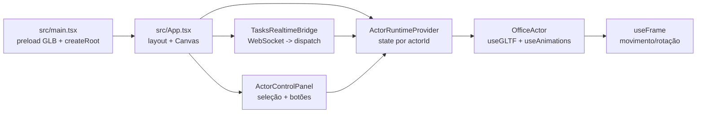

# Arquitetura da aplicação “Tasks Automation Office”

## Objetivo

Esta aplicação renderiza um “escritório” 3D no navegador com múltiplos personagens (“atores”). Cada ator possui:

- **Modelo 3D** (GLB) carregado via GLTF
- **Animação atual** (clip do GLB, com fallback por nome)
- **Comando de movimento/interação** (ir até mesa, ir até um ponto, sentar)

Além do controle manual via UI, os atores podem reagir a **eventos em tempo real** recebidos por **WebSocket**, refletindo mudanças de tarefas (ex.: status `claimed`, `done`, `failed`) ao mover/animar o ator correspondente.

## Stack e bibliotecas

- **Build/dev**: Vite (`package.json`)
- **UI**: React 19
- **3D**: `three`, `@react-three/fiber` (Canvas/loop), `@react-three/drei` (GLTF, Environment, Html, OrbitControls)
- **Realtime**: WebSocket nativo do browser

## Estrutura de pastas (componentes principais)

- **Entrada e boot**: `src/main.tsx`
- **Composição do app/cena**: `src/App.tsx`
- **Configuração de cena**: `src/sceneConfig.ts`
- **Definições de atores**: `src/office/officeActorDefinitions.ts`
- **Runtime de ator (estado global)**: `src/office/ActorRuntimeProvider.tsx`, `src/office/actorRuntimeTypes.ts`
- **Atores (modelo, animações, movimento)**: `src/office/OfficeActor.tsx`, `src/office/animationResolve.ts`
- **Móveis (mesas)**: `src/office/officeFurniture.ts`, `src/office/DeskFurniture.tsx`
- **Painel de controle**: `src/components/ActorControlPanel.tsx`, `src/components/ActorAnimationToolbar.tsx`
- **Realtime**: `src/realtime/tasksWebsocketClient.ts`, `src/realtime/TasksRealtimeBridge.tsx`, `src/realtime/tasksRealtimeTypes.ts`
- **Estilos**: `src/index.css`

## Etapa 1 — Boot, preload e renderização inicial

### Entrada (`src/main.tsx`)

O boot faz três coisas:

1. Importa `App` e o CSS global.
2. Resolve as URLs dos modelos 3D a partir de `OFFICE_ACTOR_DEFINITIONS` e faz **preload** com `useGLTF.preload(url)`.
3. Renderiza `<App />` usando `createRoot(...)` dentro de `<StrictMode>`.

O preload antecipa download/parse dos GLBs para reduzir travamentos quando os atores são montados na cena.

## Etapa 2 — Layout e montagem da cena 3D

### Composição do app (`src/App.tsx`)

O `App` organiza a tela em duas áreas:

- **Sidebar**: painel de controle (`ActorControlPanel`)
- **Canvas**: a cena 3D (`Canvas` do React Three Fiber)

Também monta um provider global de runtime:

- `ActorRuntimeProvider initialActors={buildInitialActorRuntime('idle')}`

Isso inicializa o estado de animação de todos os atores como `idle` (ver `buildInitialActorRuntime` em `src/office/officeActorDefinitions.ts`).

### Cena e iluminação

Dentro do `Canvas`:

- `PerspectiveCamera` com parâmetros em `SCENE_CONFIG.camera` (`src/sceneConfig.ts`)
- `Environment preset="city"`
- Múltiplas luzes (`ambientLight`, `hemisphereLight`, `directionalLight`), incluindo sombras
- `OfficeStage` adiciona chão, paredes, limites e mesas
- A lista `OFFICE_ACTOR_DEFINITIONS` é mapeada para múltiplos `<OfficeActor />`
- `OrbitControls` permite orbitar a câmera; `SyncOrbitCamera` garante posição/target desejados

## Etapa 3 — Atores: definição, identidade e “seleção”

### Definições (`src/office/officeActorDefinitions.ts`)

Cada ator é definido com:

- `id`: identificador estável
- `name`: nome exibido na UI e no label 3D
- `character`: nome da pasta do modelo (`/models/<character>/model.glb`)
- `spawnPosition`: posição inicial na cena

O `id` é usado como **chave de integração** com o realtime: a ponte realtime interpreta o “stage/etapa” de uma tarefa como `actorId` quando os valores batem.

### Seleção na UI (`src/components/ActorControlPanel.tsx`)

O painel mantém `selectedActorId` em estado local e oferece:

- **Seleção de ator**: botões para cada `OFFICE_ACTOR_DEFINITIONS`
- **Disparo de animações**: `ActorAnimationToolbar`
- **Interações**: lista de mesas cujo `ownerActorId` é o ator selecionado, permitindo “sentar na mesa”

## Etapa 4 — Runtime do ator (estado e comandos)

### Estado global (`src/office/ActorRuntimeProvider.tsx`)

O runtime é um `Context` com `useReducer` que armazena, por ator:

- `animationId`: string da animação desejada
- `command`: comando opcional de movimento/interação

A UI e o realtime despacham ações para atualizar esse runtime. Os atores consomem esse runtime por `useActorRuntime(actorId)`.

### Tipos e catálogo de animações (`src/office/actorRuntimeTypes.ts`)

Animações “suportadas” (e expostas na UI):

- `walk`, `sprint`, `idle`, `sit`
- `pick-up`, `emote-yes`, `emote-no`
- `interact-right`, `interact-left`

Comandos possíveis:

- `GO_TO_AND_SIT`: ir até a mesa e ao chegar sentar
- `GO_TO_DESK`: ir até a mesa com animação de movimento definida; ao chegar troca para `sit`/`idle`
- `GO_TO_POINT`: voltar para um ponto (ex.: spawn) e ao chegar troca para `idle`

### Helpers de comando (`src/office/actorInteractionCommands.ts`)

Funções importantes:

- `issueOwnerInteractWithDesk(...)`: valida se o ator é dono da mesa; emite `GO_TO_AND_SIT`
- `issueActorGoToDesk(...)`: emite `GO_TO_DESK` (muito usado pelo realtime)
- `issueActorReturnToPoint(...)`: emite `GO_TO_POINT`

O “ponto de aproximação” da mesa é calculado com base em rotação e um offset para posicionar o ator em frente ao tampo.

## Etapa 5 — Animações e movimento por frame

### Carregamento do GLB e escolha do clip (`src/office/OfficeActor.tsx`)

Para cada ator:

1. Resolve `modelUrl` (`resolveCharacterModelUrl(character)`)
2. Carrega `scene` e `animations` com `useGLTF(modelUrl)`
3. Clona a `scene` para evitar efeitos colaterais entre instâncias
4. Usa `useAnimations(animations, skinRef)` para obter `actions` e `names`
5. Quando `animationId` muda, escolhe a `AnimationAction` adequada e aplica transição com `fadeIn/fadeOut`

### Resolução robusta de nomes de animação (`src/office/animationResolve.ts`)

Como nomes de clips variam entre GLBs, a resolução:

- Normaliza strings (lower-case e remove caracteres não alfanuméricos)
- Gera variantes de busca para o `animationId`
- Adiciona fallbacks semânticos (`walk` -> `walking`, `walk_cycle`, etc.)
- Tenta match exato e depois match por “contains”
- Se nada bater, usa o primeiro clip como fallback final

### Movimento e rotação (`useFrame` em `src/office/OfficeActor.tsx`)

No loop por frame:

- Se existe `command`, o ator:
  - anda/corre em direção ao `target` com velocidade dependente de `SCENE_CONFIG.actor.speed`
  - faz clamp para manter-se dentro de `SCENE_CONFIG.actor.bounds`
  - ajusta rotação gradualmente para olhar na direção do deslocamento
  - ao atingir `arriveDistance`, troca animação de chegada e limpa o comando
- Se não existe `command` e `animationId` é `walk`/`sprint`, o ator entra em modo “wander” (andando entre alvos aleatórios dentro dos bounds)

## Etapa 6 — Móveis e “dono” da mesa

### Definição (`src/office/officeFurniture.ts`)

As mesas são peças com:

- `id`
- `position` e opcionalmente `rotation`
- `ownerActorId` (opcional)

### Render (`src/office/DeskFurniture.tsx`)

Cada mesa renderiza geometria simples e, se houver `ownerActorId`, exibe um label 2D (via `Html`) com o nome do ator dono.

## Etapa 7 — Realtime: WebSocket e tradução de eventos

### Variáveis de ambiente (Vite)

O realtime depende de:

- `VITE_TASKS_API_BASE_URL`
- `VITE_TASKS_SANCTUM_BEARER_TOKEN`
- Opcional: `VITE_TASKS_REALTIME_PUBLIC_WS_ORIGIN`

Importante:

- **Não commite tokens reais** no repositório. Use `.env.local` (ou segredos do ambiente/CI) para valores sensíveis.

### Cliente WS (`src/realtime/tasksWebsocketClient.ts`)

Responsabilidades:

- Buscar um **token de WebSocket** via HTTP:
  - `GET <apiBaseUrl>/api/realtime/tasks/ws-token` com `Authorization: Bearer <token>`
- Montar a URL:
  - usa `websocket_url` se vier do backend; caso contrário, deriva `ws://`/`wss://` do `apiBaseUrl` (ou `publicWsOrigin`) + `websocket_path`, e injeta `?token=...`
- Abrir WebSocket e manter reconexão:
  - backoff exponencial com jitter
  - “renovação” do token: agenda reconectar em metade do `expires_in_seconds`
- Entregar eventos já parseados (JSON) via callback `onEvent`

### Ponte WS → runtime (`src/realtime/TasksRealtimeBridge.tsx`)

Esta ponte é montada no `App` e roda como efeito:

1. Lê variáveis `VITE_*`; se faltar `apiBaseUrl` ou `bearerToken`, não conecta.
2. Inicia o cliente com um `subscribePayload`:
   - `type: "subscribe"`
   - `subscriptions: [{ scope: "index", page: 1, per_page: 20 }]`
3. No `onEvent`, trata:
   - `subscription.synced`: aplica a lista inicial de `tasks[]`
   - `task.*`: aplica eventos incrementais

#### Contrato de roteamento: “stage” → `actorId`

A ponte tenta extrair um identificador de etapa/stage do evento (por múltiplos campos possíveis) e só reage se esse valor for um `actorId` conhecido (definido em `OFFICE_ACTOR_DEFINITIONS`).

Em outras palavras: o realtime só “move um ator” quando o payload contém um stage/stage_slug/etc que bate com o `id` do ator.

#### Regras de comportamento

Quando um evento é associado a um ator:

- `status = "claimed"`:
  - o ator vai para a sua mesa (resolvida via `ownerActorId`)
  - movimento é `sprint` se prioridade for alta; caso contrário `walk`
- `status = "done"` ou `status = "review"`:
  - toca `emote-yes`
  - após ~1600ms, volta ao spawn e fica `idle`
- `status = "failed"`:
  - toca `emote-no`
  - após ~1600ms, volta ao spawn e fica `idle`
- Caso padrão:
  - volta ao spawn e fica `idle`

O retorno é agendado por ator com `setTimeout` e é limpo/substituído quando um novo evento chega para o mesmo ator.

## Diagrama de fluxo (alto nível)

## Checklist de entendimento rápido

- **Renderização**: `App.tsx` monta `Canvas` + `OfficeStage` + `OfficeActor[]`.
- **Escolha de ator**: `ActorControlPanel` mantém `selectedActorId` e chama `setAnimation`/interações.
- **Estado**: `ActorRuntimeProvider` é a fonte de verdade (`animationId`, `command`).
- **WebSocket**: `tasksWebsocketClient.ts` conecta com token e reconecta; `TasksRealtimeBridge.tsx` traduz eventos em comandos/animações.
- **Animações**: `OfficeActor.tsx` escolhe clip via `animationResolve.ts` e aplica `fadeIn/fadeOut`.

